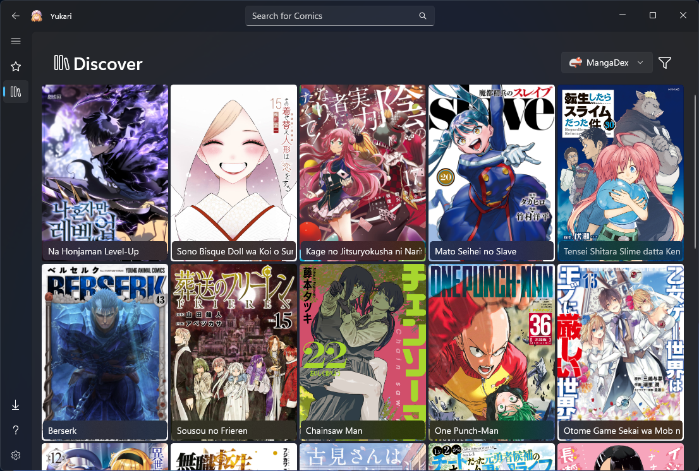

  <h1>
     Yukari
  </h1>

  
  
  
  

    <h2>📖 Overview</h2>

**Yukari** is a modern, extensible manga, webtoon and comic reader made for **Windows**.

Built with **WinUI 3** and **.NET 10**, it delivers a clean Fluent Design interface, a fast local **SQLite**-backed library, and a flexible plugin system to add any source — all 100% private with no telemetry, ads, or required accounts.

Enjoy **offline reading** of your downloaded/local collection, with optional online discovery and scraping via community plugins (e.g., MangaDex, etc.).

Currently in **experimental stage**

[More Screenshots](/Yukari/Assets/Screenshots/)

    <h2>✨ Current Features</h2>

- 📚 **Local Library** — Save your favorites, with automatic progress tracking per chapter and language
- 🔍 **Advanced Search** — Full filtering support (tags, status, etc.) in the Discover section
- 📖 **Powerful Reader** — RTL / LTR / Vertical modes, Fit Width / Fit Height / Fit Screen scaling, smooth scrolling, zoom
- ⚙️ **Dynamic Plugins** — Add as many comic/manga sources as you want (maintained by the community)
- 🌙 **Dark / Light Theme** — Automatic system theme support (Fluent Design with WinUI 3)
- 🛡️ **100% Local & Private** — No telemetry, no ads, no mandatory login or cloud sync

    <h2>📥 Installation</h2>

- ⬇️ **With Installer**:
  - Go to [Releases](https://github.com/Yukari-App/Yukari/releases) and download the latest version `Yukari.Setup.exe`;
  - Run `Yukari.Setup.exe`, then proceed with the installation, confirm what is necessary, and you're done;
  - After installation, **Yukari** will be available in your Start Menu.
- 📦 **With [Scoop Package Manager](https://scoop.sh/)**:
  - Ensure you have **Scoop** running on your machine; you can install it [here](https://scoop.sh/);
  - Add [Asterism](https://github.com/TXG0Fk3/Asterism/) Bucket running this command on **Windows Terminal** (CMD/Powershell): `scoop bucket add asterism https://github.com/TXG0Fk3/Asterism`;
  - And finally install **Yukari**: `scoop install asterism/yukari`;
  - The **Yukari** will now be available in your **Start Menu**, in a folder called "Scoop Apps"; you can run it from there.

    <h2>📚 Comic Sources Installation</h2>

**Yukari** doesn't come with pre-installed **Comic Sources** for legal reasons. You add the fonts you want through **community plugins**.

- Go to [Yukari-App Repositories](https://github.com/orgs/Yukari-App/repositories?q=Plugin+sort%3Aname-asc);
- Select a `Plugin.*` that you prefer;
- Go to **Releases** and download the `.dll` file from the latest version;
    - If your installed **Yukari** is not up to date, download a **compatible** plugin.
- Inside **Yukari**, go to **Settings** and look for **Sources**;
- Click on **Add New Source** and select the downloaded `.dll` Plugin;
- Done. Now you can go to **Discover** and search for **Comics** in that source.

    <h2>🗒️ Notes</h2>

- A **Wiki/Documentation** will be created soon;
- The project is currently in the **experimental** phase; many **features** are not yet available and there may be some **bugs**.

    <h2>🤝 Contributing</h2>
  
Contributions are welcome! You can help improve **Yukari** in several ways:

- 🐛 **Report issues**: Found a bug or unexpected behavior? Open an [issue](../../issues) describing the problem.
- ✨ **Suggest features**: Have an idea to make **Yukari** better? Share it in the issues tab.
- 🔧 **Submit pull requests**: Fix bugs, improve code quality, or add new features.

  <h2>📜 License</h2>

This project is licensed under the **GPL-3.0**. See the [LICENSE](LICENSE) file for details.

